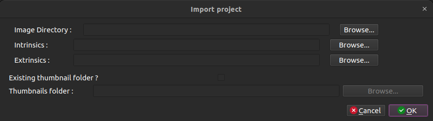
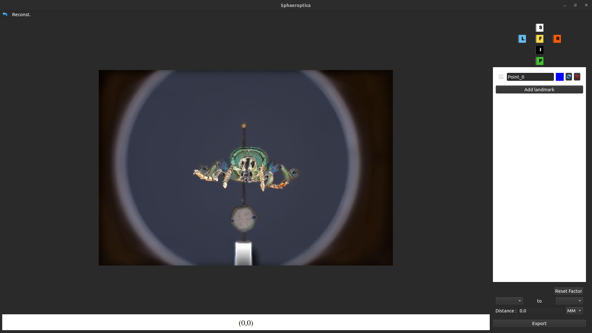
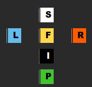
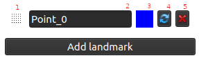
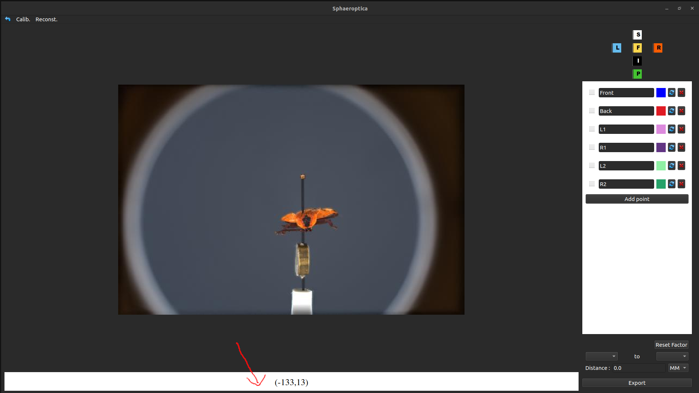
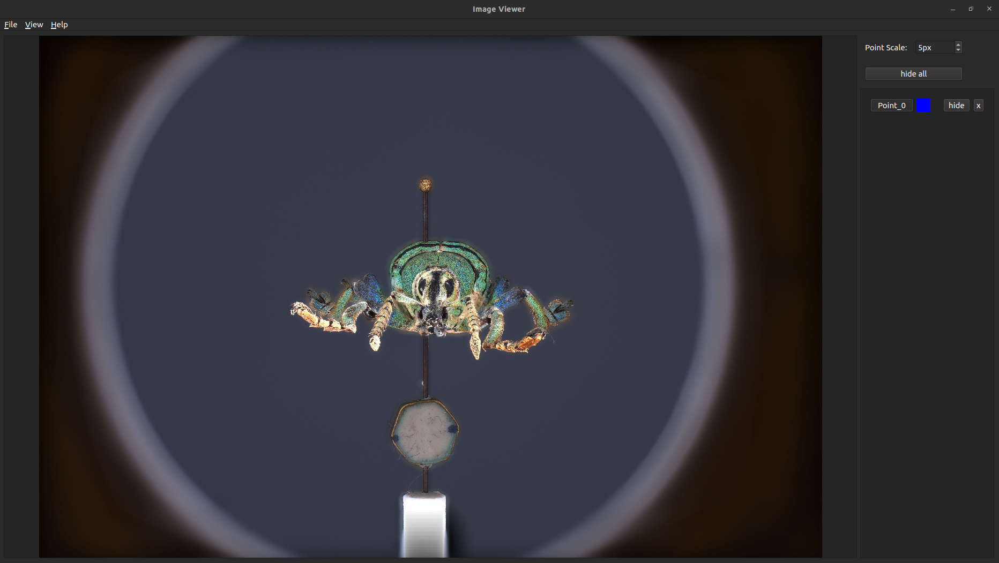
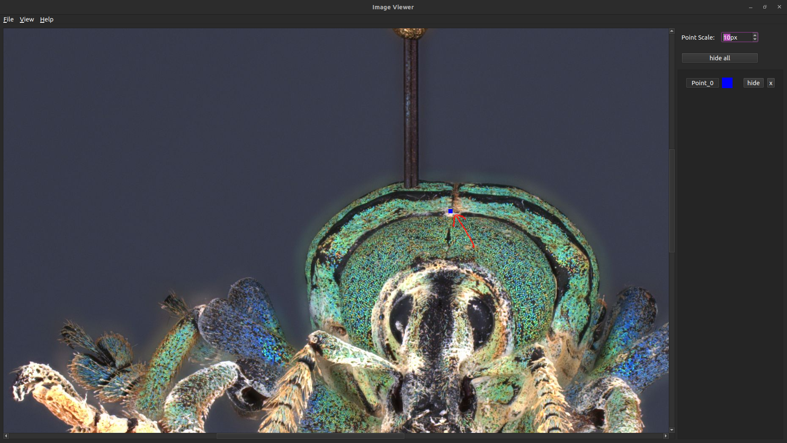
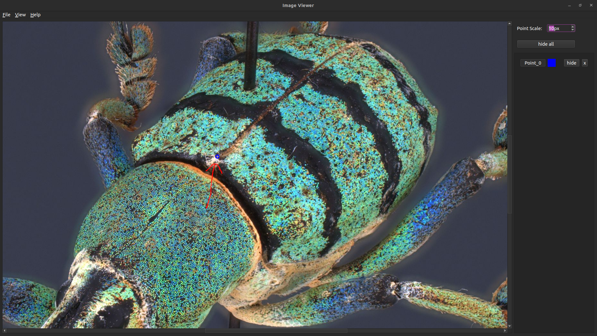
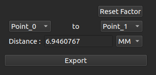

# Sphaeroptica

Sphaeroptica is an open-source viewer based on photogrammetry that allows to view 3D objects without needing to compute a 3D model.

## 1. Installation

### 1.1 Hardware requirements

We have been able to run Sphaeroptica on an old laptop with an Intel i5-7200 on Ubuntu 20.04. The program is not heavy at all.

### 1.2 Software Requirements

Here is the list of the requirements needed to run Sphaeropica :

* python >= 3.8
* numpy
* scipy
* PySide6
* imutils
* opencv-python
* matplotlib
* pandas
* bs4

Make sure that only opencv-python is installed, installing other opencv packages can create some bugs

If OpenCV and PySide6 show an error, uninstall opencv-python and use this command to install it :
```
pip3 install --no-binary opencv-python opencv-python
```


#### 1.2.1 Conda
The easiest way to install the requirements is to install the pre-configured Anaconda environment


##### On Ubuntu (22.04)
```bash
cd path/to/Sphaeroptica
conda env create -f conda_environment/conda_UBUNTU.yml
```

##### on Windows
```bash
cd path/to/Sphaeroptica
conda env create -f conda_environment/conda_WINDOWS.yml
```

After the initialization of the environment, restart the terminal and activate it :
```bash
conda activate Sphaeroptica
```

#### 1.2.2 Pip 

But if you prefer to install them through pip, we created a file that contains all the requirements, you can install them with these : 
```bash
pip3 install -r requirements.txt
``` 
or
```bash
python3 -m pip install -r requirements.txt
``` 

## 2. Create your own Sphaeroptica project

Start the application :

```bash
cd path/to/Sphaeroptica
python3 app.py
```

### 2.1 Data folder

The only requirement is to have a folder with the images, the intrinsic parameters in a XML file, and the extrinsic parameters in a JSON file.

```bash  
├── export_extrinsics.json
├── export_intrinsics.xml
├── *.jpg (all images)
├── ...
```

When you decide to create a new project file, this is the window that will appear :



### 2.2 Import images

On "Image Directory", browse to the folder containing all the images and select it.


### 2.3 Specify the intrinsic and extrinsic files

On "Intrinsics", select the XML file containing the intrinsics values.  
The file should look like this :
```xml
<?xml version="1.0"?>
<opencv_storage>
<calibration_Time>"Mon Apr 17 14:24:32 2023"</calibration_Time>
<image_Width>5472</image_Width>
<image_Height>3648</image_Height>
<Camera_Matrix type_id="opencv-matrix">
  <rows>3</rows>
  <cols>3</cols>
  <dt>d</dt>
  <data>
    fx 0. cx 0. fy cy 0. 0. 1.</data></Camera_Matrix>
<Distortion_Coefficients type_id="opencv-matrix">
  <rows>5</rows>
  <cols>1</cols>
  <dt>d</dt>
  <data>
    k1 k2 p1 p2 k3</data></Distortion_Coefficients>
</opencv_storage>
```

On "extrinsics", select the json file containing the extrinsics values for each of the images
The file should look like this :
```json
{
    "IMAGE1.jpg": {
        "matrix": [
            [r11,r12,r13,t1],
            [r21,r22,r23,t2],
            [r31,r32,r33,t3],
            [0.0,0.0,0.0,1.0]
        ]
    },
    ...
}
```

These two files are not required to be in the folder for the program to work correctly.

### 2.4 Thumbnails
If thumbnails have already been created, you can specify it. But it isn't required, and in this case, Sphaeroptica will create them for you in a folder called "thumbnails".

### 2.5 Save the project file
Sphaeroptica will save the project file in JSON format directly in the folder.
That file will contain all the data needed for Sphaeroptica : 
* intrinsic calibration
* extrinsic
* distortion coefficients
* a directory of thumbnails for the virtual camera

The folder structure will look like this :
```bash  
├── project.json (project viewer file)
├── export_intrinsics.xml (optional)
├── ext.json (optional)
├── thumbnails
│   ├── *.jpg
│   ├── ...
├── *.jpg
├── ...
```

## 3. Virtual camera
When you open a project, the first screen you'll see is the virtual camera


On the left, we have the virtual camera, displaying the nearest referenced image (thanks to geometric computations).

On the right, we have :
* Quick buttons to get to a desired view (Frontal, Posterior, Left, Right, Inferior, Superior)
* A list of desired 3D points
* A distance calculator between two 3D points

### 3.1 How to use the virtual camera

With a left click on the image, you will move around a theoretical sphere using geodesic coordinates (Longitude and latitude).  
Moving the mouse horizontally and vertically will respectively change the longitude and latitude of the virtual camera.

It is also possible to change those coordinates with the arrows on your keyboard.

Each time the value change, Sphaeroptica will find the nearest image (thanks to the comparison of the coordinates of the virtual camera and the ones of every image) and display it.

### 3.2 View shortcuts

Sphaeroptica allows to have a shortcut to some designated views : 
* superior view S
* left view L
* frontal view F
* right view R
* inferior view I
* posterior view P



Left-clicking on these widget would move the virtual camera to the desired view.  
Right-clicking would set the value of the desired view to the current view and it will automatically save it to the project file.

## 4. Landmarks Placement

The main feature of Sphaeroptica is the possibility to create landmarks and compute their 3D positions (to be able later to make geometric computation).  
For this, we need to configure the landmark and to place it on at least 2 images.

### 4.1 Landmark configuration

You can add as many landmarks as needed for you.  
For each landmark it is possible to (in order):
1. change its position in the list
2. change its label
3. change its color
4. reset its 3D position and all its references on images
5. delete it.



### 4.2 Place a landmark on an image

If you click on the widget containing the geodesic values, you will display the image in a 

Where to click :


The new window :
  

Choose the landmark you want to place, either by :
* clicking directly on the button with the landmark label
* pressing the + key (goes down the list)
* pressing the - key (goes up the list)

Left clicking on the image will place the designated landmark on the image.



When a landmark has been placed on multiple image (minimum 2), Sphaeroptica will triangulate its 3D position. That position will then be reprojected on every new image.



### 4.3 Zoom on the image

You have the possibility to zoom on the image as much as you want to be able to precisely place the landmark at the right pixel.

Here is a list of the actions you're allowed do to zoom in on the image :
* Ctrl++ : zoom 5% in
* Ctrl+- : zoom 5% out
* Ctrl+s : zoom to fit the image entirely in the window
* Ctrl+f : zoom to the resolution of the image

When the image is bigger than the screen, you can

### 4.4 Widen the landmarks on the images
It is possible to adjust the size of the landmarks placed on the image.
However, be aware that making the landmark bigger, even though if it makes it easier to find, makes it harder to know where it is precisely located.

## 5. Measurements

When two landmarks have a 3D position, we can measure the distance between them two.



You can select a defined scale (M, CM or MM), depending on the size of the object.

Additionally, you can rescale all the measurements thanks to a reference. 
If there is a known distance between two points on the object, you can set it manually by writing it on the distance calculator.  
After that, Sphaeroptica will automatically modify all the distances computed and it is reversible by pressing the button "Reset Factor".

### 5.1 Export points into a csv

Clicking the "Export" button would allow you to export all the points in a csv format.  
The format will look like this : 
```csv
Label	Color	X	Y	Z	X_adjusted	Y_adjusted	Z_adjusted 
```
with :
* Label, the label of the landmark
* X,Y,Z, the 3D coordinates of the landmarks
* X_adjusted, Y_adjusted, Z_adjusted, the refined coordinates (the coordinates multiplied by the scale factor)

## 6. How to make your own sphere of images

Sphaeroptica needs has two requirements : 
* A set of images taken around an object (at equal distance and with the same camera)
* the calibration of these images

### 6.1 Image Acquisition

For the first requirement, every technique is allowed, as long as you have enough pictures to have enough overlap for their calibration. As it is very visual, because the virtual camera hops between each picture, it is encouraged to have enough pictures to have a smooth movement on it.

In our case, we used [scAnt](https://github.com/evo-biomech/scAnt). We choose to have 180 pictures per specimen. 

### 6.2 Focus Stacking (optional)

It is necessary for smaller specimens with a lot of details, and focus stacking distortion is negligible for the calibration and triangulation (as our tests suggests).

The best stacker software that we've tested are Zerene Stacker and Helicon Focus ([Here](https://www.ncbi.nlm.nih.gov/pmc/articles/PMC4284632/)) and Helicon Focus uses the GPU for its computations (thus, is much faster).  
However, these are softwares with a paid license. A free open-sourced solution would be Enfuse (even though, it gives a halo around the object).

### 6.3 Calibration

For the calibration, using the SfM softwares that you are already using is recommended, as it is better to be used to it.  
Unfortunately, the data that is exported from the software has to be in the form shown in [2.3](#2.3-Specify-the-intrinsic-and-extrinsic-files).

We used Agisoft Metashape Professional Edition, one of the most used proprietary software to digitize collections. And thus developed converters around the data that we get from Agisoft Metashape. Unfortunately, the license fee changed for scientific establishement, making it expensive.

If you use another software, you will have to make your own converter.  
However, to make the program more accessible to anyone, we are developing a converter from data exported by [COLMAP](https://github.com/colmap/colmap), as it is a free open-source project.

Please, make sure that the pictures are correctly oriented and rotated.  
Frontal view should be at (0,0) with lateral views at (-90,0) and (90,0). You can rotate the specimen in a SfM software, but not doing so may cause some problems for Sphaeroptica.

#### 6.3.1 Convert from Metashape project

If you use Agisoft Metashape, here are the steps you have to do to convert your data for Sphaeroptica.

When you're images are calibrated (with "Align Photos"), you can export the intrinsics parameters with  Tools > Camera Calibration > Adjusted, and export it in "OpenCV Camera Calibration (*.xml)" format. This will give you the file needed for the intrinsics values in Sphaeroptica.

For the extrinsics, you have to go to File > Export > Export Cameras, and export the file as "Omega Phi Kappa (*txt)".  
This CSV file still has to be converted into the needed JSON file.  
Fortunatel, we developed a script that does that and that is available at [scripts/additional/import_cameras_to_sphaeroptica.py](scripts/additional/import_cameras_to_sphaeroptica.py)

```bash
cd path/to/Sphaeroptica
python3 scripts/additional/import_cameras_to_sphaeroptica.py -i path/to/csv.txt -o path/to/output.json
```

### 6.4 Data folder needed

## Contributing

We know this project is far from perfect and are working on a 2nd version using web technologies (allowing easier deployment of Sphaeroptica).  

We are aware that the architecture of this app is sub-optimal and are working on it on that iteration.  
Thus, we won't allow Pull Request now, as it is unnecessary.

However, feel free to create a Issue to send suggestions on elements to improve or even bugs, in case we miss some.

## Credits

Icons from Fugue Icon Set — Yusuke Kamiyamane : https://p.yusukekamiyamane.com/
