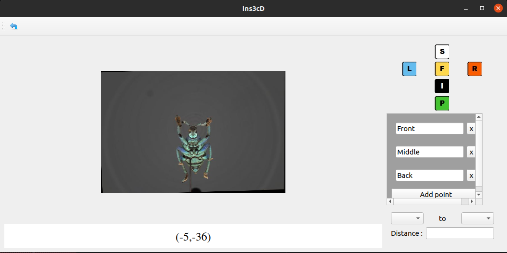
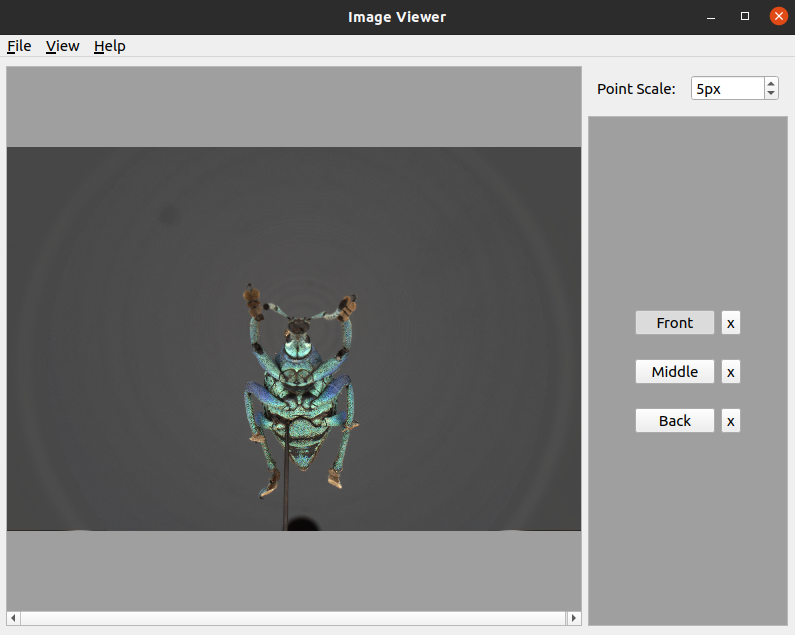

# Sphaeroptica

Sphaeroptica is an open-source viewer based on photogrammetry that allows to view 3D objects without needing to compute a 3D model.

## Requirements

Here is the list of the requirements needed to run Sphaeropica :

* python >= 3.8
* numpy
* scipy
* pyqt 6
* imutils
* opencv-python
* matplotlib

Make sure that only opencv-python is installed, installing other opencv packages can create some bugs

You can install these requirements with :
```pip3 install -r requirements.txt```

## Quick Start Guide

Start the application with :

```python3 app.py```

Sphaeroptica has two functionalities : 
* calibration with Zhang pattern
* view and measurements of an object
### Calibration

Select the directory that contains all the images needed for the calibration process.

Put the number of points that can be found in the pattern, first the lenght, then the width.   
It is usually the number of squares + 1.
For the test_calib directory in data, it will be 9*6.

Add the length and width of the squares

And then press `Calibrate Scanner` to launch the calibration process.

Finally, save the calibration data in a json form if needed.

### View and measurements

Import the calibration.json file in data/geonemus-geoffroyii. It contains all the data needed for the viewing of the images in the same directory : 
* intrinsic calibration
* extrinsic
* distortion coefficients
* a directory of thumbnails for the virtual camera



On the left, we have the virtual camera.

On the right, we have :
* Quick buttons to get to a desired view
* A list of desired 3D points
* A distance calculator between two 3D points

Click on values under to display the nearest image to be able to place landmark for the triangulation of points



Place landmarks on the points that you can see on the image.

When two or more landmarks have been placed for the same point, Sphaeroptica will start compute the 3D coordinates of this point thanks to a triangulation of these landmarks placed.

### Additional scripts

We added multiple scripts to make the conversion easier between data from the software Agisoft Metashape and Sphaeroptica.

#### Show extrinsics
Plots the extrinsics parameter of cameras. These parameters should be contained in a JSON File.

* Input -i : Path of JSON File containing the extrinsics

```python3 scripts/additional/show_extrinsics.py -i ./data/```

#### Create camera reference CSV for Agisoft Metashape
Creates a CSV File that contains the estimated world coordinates of each camera, this file will be used as an import in Metashape.

* Input -i : Path of JSON File containing the calibration parameters of the cameras where a chess pattern was recognized.
* Dataframe -d : CSV of old import reference file to get all the image name and old positions
* Output -o : Path of CSV file that will contain the camera references

```python3 scripts/additional/create_csv_for_metashape.py -i ../images/calib_stacked/calibration_intrinsics.json -d ./new_import_camera_stacked_old.csv -o ./new_import_camera_stacked.csv```


#### Create extrinsics file for Sphaeroptica
Creates a JSON file that will contain the extrinsics parameters of the cameras

* Input -i : Path of the CSV File containing the OPK values for each cameras
* Output -o : Path of JSON file that will contain the camera parameters

```python3 scripts/additional/import_cameras_to_sphaeroptica.py -i data/geonemus-geoffroyii/export_csv.txt -o data/geonemus-geoffroyii/ext.json```

## Credits

Icons from Fugue Icon Set — Yusuke Kamiyamane : https://p.yusukekamiyamane.com/
