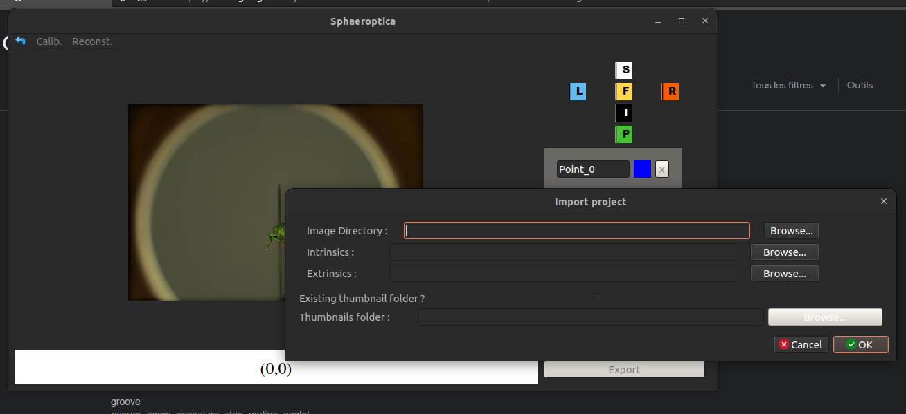

# Sphaeroptica

Sphaeroptica is an open-source viewer based on photogrammetry that allows to view 3D objects without needing to compute a 3D model.

## Requirements

Here is the list of the requirements needed to run Sphaeropica :

* python >= 3.8
* numpy
* scipy
* pyqt 6
* imutils
* opencv-python
* matplotlib

Make sure that only opencv-python is installed, installing other opencv packages can create some bugs

If OpenCV and Pyqt6 show an error, uninstall opencv-python and use this command to install it :
```pip3 install --no-binary opencv-python opencv-python```

You can install these requirements with :
```pip3 install -r requirements.txt```

## Quick Start Guide

Start the application with :

```python3 app.py```

Sphaeroptica has two functionalities : 
* calibration with Zhang pattern
* view and measurements of an object
### Calibration

Select the directory that contains all the images needed for the calibration process.

Put the number of points that can be found in the pattern, first the lenght, then the width.   
It is usually the number of squares + 1.
For the test_calib directory in data, it will be 9*6.

Add the length and width of the squares

And then press `Calibrate Scanner` to launch the calibration process.

Finally, save the calibration data in a json form if needed.

### View and measurements

Import the calibration.json file in data/geonemus-geoffroyii. It contains all the data needed for the viewing of the images in the same directory : 
* intrinsic calibration
* extrinsic
* distortion coefficients
* a directory of thumbnails for the virtual camera


On the left, we have the virtual camera.

On the right, we have :
* Quick buttons to get to a desired view
* A list of desired 3D points
* A distance calculator between two 3D points

Click on values under to display the nearest image to be able to place landmark for the triangulation of points


Place landmarks on the points that you can see on the image.

When two or more landmarks have been placed for the same point, Sphaeroptica will start compute the 3D coordinates of this point thanks to a triangulation of these landmarks placed.

### Additional scripts

We added multiple scripts to make the conversion easier between data from the software Agisoft Metashape and Sphaeroptica.

#### Show extrinsics
Plots the extrinsics parameter of cameras. These parameters should be contained in a JSON File.

* Input -i : Path of JSON File containing the extrinsics

```python3 scripts/additional/show_extrinsics.py -i ./data/```

#### Create camera reference CSV for Agisoft Metashape
Creates a CSV File that contains the estimated world coordinates of each camera, this file will be used as an import in Metashape.

* Input -i : Path of JSON File containing the calibration parameters of the cameras where a chess pattern was recognized.
* Dataframe -d : CSV of old import reference file to get all the image name and old positions
* Output -o : Path of CSV file that will contain the camera references

```python3 scripts/additional/create_csv_for_metashape.py -i ../images/calib_stacked/calibration_intrinsics.json -d ./new_import_camera_stacked_old.csv -o ./new_import_camera_stacked.csv```


#### Create extrinsics file for Sphaeroptica
Creates a JSON file that will contain the extrinsics parameters of the cameras

* Input -i : Path of the CSV File containing the OPK values for each cameras
* Output -o : Path of JSON file that will contain the camera parameters

```python3 scripts/additional/import_cameras_to_sphaeroptica.py -i ../images/lyssandra_bellargus_stacked/cameras.txt -o ../images/lyssandra_bellargus_stacked/ext.json```

```python3 scripts/additional/import_cameras_to_sphaeroptica.py -i ../images/IMAGE_DIRECTORY/CAMERAS_POSITIONS_OPK.txt -o ../images/IMAGE_DIRECTORY/EXTRINSICS_OUTPUT.json```

## Processus of digitization with scAnt and Agisoft Metashape

### Image acquisition and stacking with scAnt

Open a terminal and change the current directory to the directory of scAnt : 
```cd ~/PATH_TO_SCANT```

Start the application : ```python3 scAnt.py```

On the following image, there are 2 groups of parameters that are important for the scan : 
* Camera Settings : The different parameters on how the camera will take the images
* Stepper Control : the different parameters for the motors


In Scanner Setup, do not check the "Stack images" box as it will not work properly. The stacking process has to be done separately.

To do the stacking process, run the following command : ```python3 scripts/focus_stacking_MP.py -i NAME_OF_PROJECT/RAW```.

All the stacked images will be saved in the directory RAW_stacked.

### Camera calibration with Agisoft Metashape

Now that we have the pictures, we need to align them.  
Start Agisoft Metashape and do the following sequence :
1. Add the photos to the project
2. Add camera references with a csv file (optional)
3. Align photos as precisely as you can
4. Save the intrinsic parameters of the camera (Tools -> Camera Calibration -> in the adjusted tab) as an OPENCV Camera Calibration file (.xml) (to make it easier, save it in the same directory as the pictures)
5. Save the extrinsics parameters of the cameras (File -> Export -> Export Cameras) as an Omega-Phi-Kappa file (.txt) (as for the intrinsic parameters, save it in the same directory)

### View with Sphaeroptica

Now that we have the camera parameters from Agisoft Metashape we can view our object.  

Firstly, move to the directory that contains Sphaeroptica : 
```cd ~/PATH_TO_SPHAEROPTICA```

Before viewing the object, we have to convert the OPK File (the file that contains the extrinsics parameter) to a json file that Sphaeroptica will understand. 

Run the following command to create that file : ```python3 scripts/additional/import_cameras_to_sphaeroptica.py -i ../images/IMAGE_DIRECTORY/CAMERAS_POSITIONS_OPK.txt -o ../images/IMAGE_DIRECTORY/EXTRINSICS_OUTPUT.json``` 

Start Sphaeroptica : ```python3 app.py```

Create a new project by :
1. Selecting the directory that contains all the images
2. Selecting the XML that contains the intrinsic parameters
3. Selecting the JSON file that contains the extrinsic parameters
4. Selecting the directory that contains the thumbnails (optional, if it isn't selected, Sphaeroptica will create it itself)
5. Saving the resulted JSON file in the image directory (this will be the file that will be used by Sphaeroptica)



At the end the directory structure for one project should look like something like this :
```bash  
├── calibration.json (project viewer file)
├── export_csv.txt (optional)
├── export_intrinsics.xml (optional)
├── ext.json (optional)
├── thumbnails
│   ├── *.jpg
│   ├── ...
├── *.jpg
├── ...
```

## Credits

Icons from Fugue Icon Set — Yusuke Kamiyamane : https://p.yusukekamiyamane.com/
